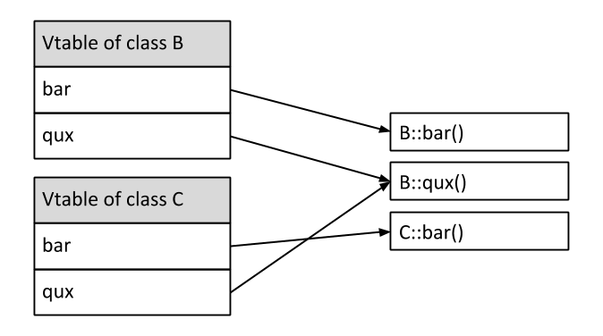

# Java Vs C++

* principali differenze
* OOP - programmazione ad oggetti
  * eridaterietá
  * polimorfismo

- variabili
    - globali
    - locali/automatiche

- principi di parnas
  - information hiding
  - chiaro modo per fare le cose. un valore può essere cambiato solo attraverso la funzione prevista
  - funzioni self-contained, hanno tutto ciò di cui hanno bisogno
  - need to know
  - codice chiaro e non oscuro

- non ci sono i puntatori

- vtable in memoria
  - detta Virtual Table
  - 
  - tabella associata ad ogni classe che contiene puntatori alle locazione di memoria dei metodi